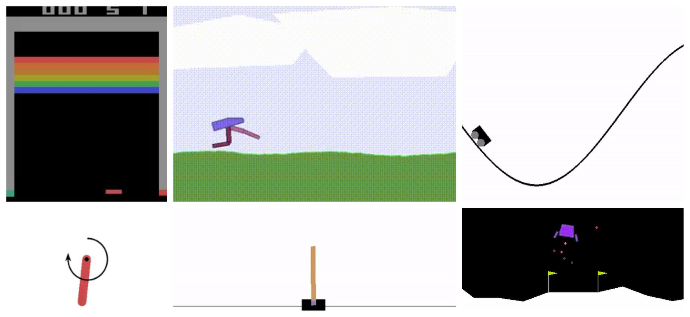

# **<project>**

# A Deep Reinforcement Learning framework : RLearn

RLearn is a framework for Deep Reinforcement Learning made by myself. I implements diverse RL algorithms and try to make them learn on various environnements. It is based on the [OpenAI Gym](https://gym.openai.com/) and [pytorch](https://pytorch.org/).

<p align="center">
  
</p>

# Table of Contents

- [Installation](#installation)
- [Usage](#usage)
- [Results](#results)
- [Agents](#agents)

# Installation

**Advised : create a virtual env :**

```bash
python -m venv venvRLEARN
source venvRLEARN/bin/activate # on linux
venvRLEARN\Scripts\activate    # on windows
```

**Install the package from source:**

```bash
git clone git@github.com:tboulet/Deep-RL-Framework.git
cd Deep-RL-Framework
pip install -e .
``` 


# Usage

**For training algorithms:**

```bash
rlearn train
```


# Results

### WandB
If wandb is activated, the results will be logged on wandb. For this you need to have a wandb account and to have specified your IDs in the settings.py file. 

### Tensorboard
If tensorboard is activated, the results will be logged on tensorboard in the logs/tb/ directory. You can start tensorboard with the following command:

```bash
tensorboard --logdir=logs/tb/
```

### Render
If n_render is specified, the agent will render the environment at each n_render episode.

### Logging
If the dump option is activated, the results will be logged in the logs/dumped_metrics folder (not available for now).

### Print
If the print option is activated, the results will be printed in the console.


# Agents

Agent are objects that can be trained on an environnement. They can be found in the rlearn/algorithms folder. The following agents are available:
- DQN
- PPO
- Random
- DDPG
- AC
- REINFORCE

## Creating an agent :

For creating a new agent (example DQN), you must :
- add a yaml config file in the right folder : ```rlearn/configs/algo/dqn.yaml``` that must contain :
    - the name of the agent class
    - the algorithm name
    - the algorithm parameters (gamma, lr, etc.)

```rlearn/configs/algo/dqn.yaml``` :
```yaml
create_algo_fn_string: rlearn.agents.dqn:DQN
algo_name: DQN

algo_config:
  #Hyper-parameters
  gamma : 0.99
  sample_size : 256
  learning_rate : 0.001
  ...
```
- create the agent class in the corresponding folder : ```rlearn/agents/dqn.py``` that must inherit from the ```Agent``` class and implement the Agent interface :
    - ```act``` : return the action to take given the observation
    - ```learn``` : do any learning in this phase
    - ```remember``` : store the experience in the memory
    - ```get_supported_action_space_types``` : return a list of supported action space types (discrete or continuous) that the algorithm can handle. For DQN, it is only discrete because DQN can't handle continuous action space.
    - additonally, the init method must call the ```Agent``` init method with the config file path as argument.
    
```rlearn/agents/random.py``` :
```python
from rlearn.agents import Agent
import gym

class RandomAgent(Agent):
    '''A random agent
    '''
    @classmethod
    def get_supported_action_space_types(cls):
        return ["discrete", "continuous"]

    def __init__(self, env : gym.Env, config : dict):
        super().__init__(env = env, config = config)
        # do any initialization here
    
    def act(self, obs):
        action = self.env.action_space.sample()
        self.add_metric('act', any_name = 1234)
        return action
    
    def learn(self):
        # do any learning here
        self.add_metric('learn')
        pass
    
    def remember(self, *args):
        # store the experience in the memory here
        self.add_metric('remember')
        pass
```
- Additionaly, if you want to log metrics, you can use the ```add_metric``` method of the ```Agent``` class at the end of your act, learn and remembler methods. This will save internally metrics that metric managers will be able to use to. Check rlearn/core/metrics.py for more details on how to log metrics.


<!-- **For training an agent on a registered Gym environnement anywhere, run this command: (WIP)**

```bash
python -m rlearn train --agent <agent_name> --env <env_name>
``` -->


